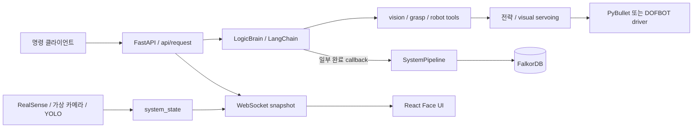

# MACH-VII 로봇 에이전트 실험

카메라 인식, LLM 도구 선택, 로봇 동작, 얼굴 표현과 행동 기록을 연결한 로봇 프로젝트 모음.

## 어디부터 볼지

| 폴더 | 구현과 읽을 지점 |
|---|---|
| [machvii-v2.0](machvii-v2.0/README.md) | FastAPI·React, WebSocket 상태, LangChain agent, PyBullet/DOFBOT adapter, FalkorDB |
| [machvii-v1.0](machvii-v1.0/README.md) | 이전 agent·시뮬레이터 실험. 좌표계·로봇 각도·작업 공간 수정 필요 기록 유지 |
| [army-simulator-proto](army-simulator-proto/README.md) | Streamlit·WebRTC, YOLO와 LLM 반응, GIF 얼굴을 연결한 초기 프로토타입 |

핵심 구현은 v2의 `main.py`와 `interface/backend/api_server.py`에서 시작한다. 자연어 명령을 agent에 넘기고, 상태는 WebSocket `/ws`로 React 얼굴 화면에 전달한다. 전략 필터와 로봇 driver, 기억 저장을 별도 모듈로 다룬다. “7 Layer”는 설계 구분이며 실제 import와 실행 흐름은 [현재 아키텍처](machvii-v2.0/docs/ARCHITECTURE_STATUS.md)에 정리했다.

영상·상태 수집, 행동 판단, 물리 실행과 화면 표현은 서로 다른 주기로 움직인다. 고정된 Windows Conda 환경과 장비·외부 서버가 전제되어 clone만으로 실행을 보장하지 않는다. 성능·안전성·성공률은 문서의 목표 주기나 함수 존재만으로 주장하지 않는다.

v2 실행과 API는 [v2 README](machvii-v2.0/README.md), [API 계약](machvii-v2.0/docs/API.md)을 본다. `참고/` 안의 외부 로봇·시뮬레이터 자료는 자체 구현 성과와 구분한다.
