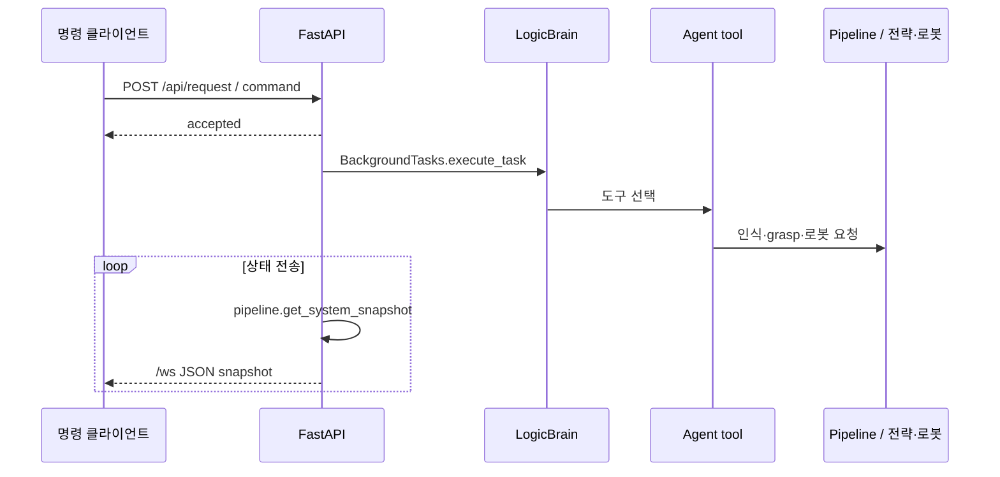

# 현재 아키텍처와 실행 경계

## 설계 명칭과 실제 호출

Sensor·State·Brain·Strategy·Expression·Embodiment·Memory의 7개 영역은 책임 구분이다. 모든 모듈이 순차적인 DTO 전달만으로 실행되는 것은 아니다. `api_server.py`는 brain·sensor·strategy·memory·embodiment 인스턴스를 직접 사용하고 `pipeline.py`도 state와 strategy를 import한다. strict interface와 no reverse flow는 [설계 지침](ARCHITECTURE_GUIDELINES.md)으로 읽는다.

## 명령과 관측

accepted 응답은 비동기 작업을 접수했다는 뜻이다. 작업 성공 응답이 아니다. 명령의 정지 키워드는 agent를 우회해 stop_agent·visual_servoing.stop·driver.emergency_stop을 호출한다.

robot_action 도구는 broadcaster에 action_intent를 직접 발행한다. 도구 미사용 완료 callback에는 pipeline.process_brain_intent 경로도 있어 모든 도구가 pipeline을 순서대로 통과하지는 않는다.

`SystemSnapshot`은 timestamp, brain, emotion, perception, robot, strategy와 last_frame/last_depth/그리퍼 영상을 묶는다. DTO가 있다고 여러 thread의 관측이 동일 시각의 원자적 snapshot으로 보장되는 것은 아니다. RLock을 사용하는 singleton과 controller가 있지만 전체 deadlock·latency 측정 결과를 뜻하지 않는다.

## 기억과 결과

FalkorDB manager는 Episode → Action, Episode → 시작/종료 Emotion 관계를 Cypher로 저장한다. 미연결 시 저장을 건너뛰고 일부 조회는 0.5 기본값을 반환한다. pipeline의 `result: executed`는 명령 하달을 기록한다. success/failure에 기반한 조회가 실제 로봇 성공률 측정과 일치하는지는 따로 검증해야 한다.

## 재현 조건

Windows Conda export, 외부 Ollama endpoint, 모델 파일, RealSense와 캘리브레이션, 별도 로봇/시뮬레이터 HTTP 서버를 전제로 한다. PyBullet 기본 포트는 config의 5000이며 이전 문서의 5001과 달랐다. 외부 참고 구현은 `참고/`에 있고 프로젝트 자체 backend와 구분한다.

[main.py](../main.py) · [API server](../interface/backend/api_server.py) · [pipeline](../shared/pipeline.py) · [DTO](../shared/ui_dto.py) · [memory](../memory/falkordb_manager.py) · [GlobalConfig](../shared/config.py)
